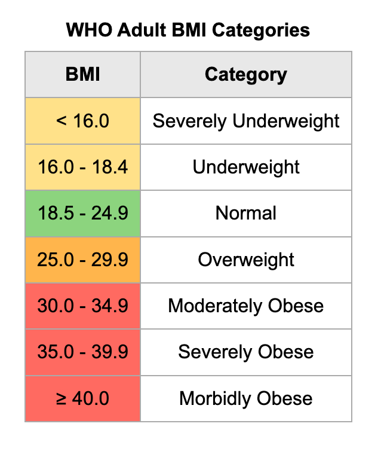

# BMI Calculator

A simple BMI (Body Mass Index) calculator web application built using HTML, CSS, and JavaScript.

## Table of Contents

- [Description](#description)
- [About BMI](#about-bmi)
- [Demo](#demo)
- [Features](#features)<!-- - [Screenshots](#screenshots) -->
- [How to Use](#how-to-use)
- [Contributing](#contributing)
- [License](#license)
- [Contact](#contact)

## Description

The BMI Calculator project provides a simple web application designed to help users calculate their Body Mass Index (BMI) based on user-provided height and weight measurements. It can be a helpful tool for individuals to get an idea of their general weight status and take steps towards a healthier lifestyle.

## About BMI

The Body Mass Index (BMI) is a widely used measure that helps assess the body weight relative to height. It provides an indication of whether an individual's weight is within a healthy range based on their height.

BMI is calculated by dividing a person's weight (in kilograms) by the square of their height (in meters). The resulting value is then categorized into different BMI ranges, each associated with a general weight status (e.g., underweight, normal weight, overweight, obese).

BMI is commonly used by healthcare professionals, researchers, and individuals as a screening tool to identify potential weight-related health risks. While it provides a useful assessment of body weight, it is important to note that BMI alone does not account for factors such as muscle mass, bone density, and other individual variations. Therefore, it should be used as a starting point in conjunction with other health indicators to make informed decisions about overall health and well-being.

### BMI Charts
BMI (Body Mass Index) charts are graphical representations of Body Mass Index values that help visually categorize an individual's weight status based on their height and weight. These charts are commonly used by healthcare professionals, researchers, and individuals to quickly assess whether a person's weight falls within a healthy range.

BMI charts typically consist of a grid with two axes: one for height and the other for weight. The height is represented on the vertical axis, and the weight is represented on the horizontal axis. The intersection of a specific height and weight value corresponds to a BMI value.

The BMI value is color-coded or shaded to indicate the weight category associated with that BMI.

For more accurate health assessments and personalized advice, it is always recommended to consult with a healthcare professional or registered dietitian.

## Demo

You can try out the BMI Calculator live on [GitHub Pages](https://your-username.github.io/bmi-calculator) or see the [demo video](https://example.com/bmi-calculator-demo) for a quick overview.

## Features

- Input fields for height and weight measurements.

- Automatic BMI calculation upon entering height and weight after clicking 'Check' button.

- Results displayed with BMI category (underweight, normal weight, overweight, etc.).

- Supports multiple units for height and weight, providing users with the flexibility to input their measurements in either metric or imperial units.
The available units include:

     ### Height Units
      Centimeters (cm)
      Meters (m)
      Feet (ft)
      Inches (in)

     ### Weight Units
      Kilograms (kg)
      Pounds (lbs)

<!-- ## Screenshots

 -->

## How to Use

1. Open the BMI Calculator web application in your web browser.

2. Enter your height in centimeters or feet/inches and your weight in kilograms or pounds.

3. The BMI will be automatically calculated and displayed, along with the corresponding BMI category.

## Contributing

Contributions are welcome! If you have any suggestions, feature requests, or bug reports, please feel free to open an issue or submit a pull request.

## License

This project is licensed under the [MIT License](LICENSE).

## Contact

For any questions or inquiries, please contact [deepakshukla2442@gmail.com](mailto:deepakshukla2442@gmail.com).

---